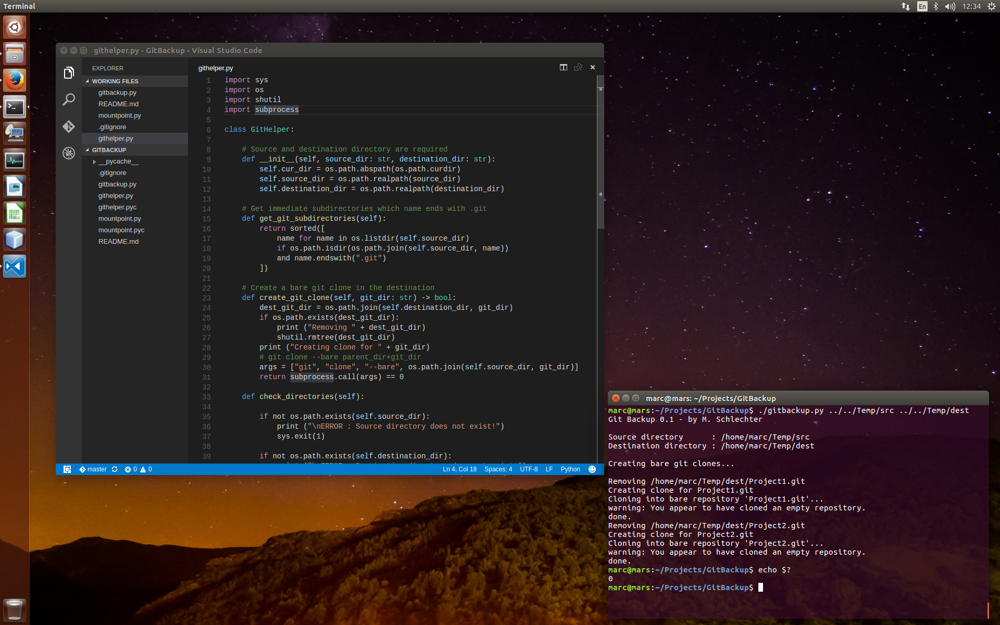

# GitBackup

Script to backup all bare git repositories in a given source directory. The
script searches for immediate subdirectories which name ends with ".git" and
clones them into a destination directory.

TODO:

1. Add mountpoint support. Making it possible to mount a backup share on demand
   and unmount it when the script is done.
2. Improve command arguments parsing and add more options (verbosity, mountpoint,
   etc).
